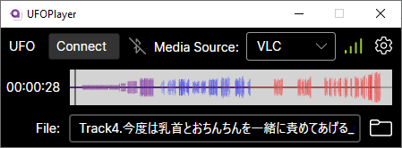

# UFOPlayer

UFOPlayer connects directly to your Vorze U.F.O TW via Bluetooth and synchronizes with media players. 

## How To Use

1. Connect to U.F.O by clicking “Connect” and select device from list of discoverable.
    1. Click on “UFO” to show options to test which side is right and to flip if needed.
2. Select a Media Source from dropdown.
3. Open a video or audio file with your selected media source.
4. Scripts are loaded by:
    1. Selecting or dropping a CSV script for the media.
    2. UFOPlayer will automatically add any CSV file with the selected media file’s name + “UFO” in the file name.

## List of Supported Media Players

* VLC
* DeoVR

## Requirements

Windows 10 or Later
